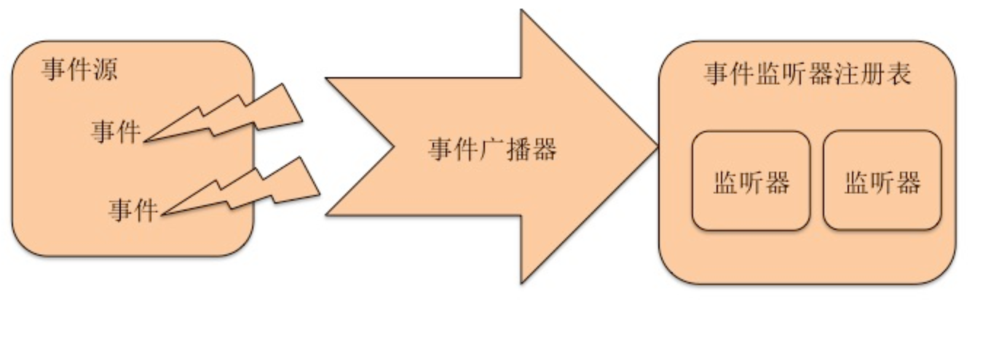

# azeroth-event
轻量级事件驱动框架

[事件驱动框架概念](https://baike.baidu.com/item/%E4%BA%8B%E4%BB%B6%E9%A9%B1%E5%8A%A8%E6%9E%B6%E6%9E%84/883637)

>使组件间有了更好的解耦，让我们能在领域驱动设计(DDD)中以事件的弱引用本质对我们的模块和领域边界很好的解耦设计。  

>起初是内部使用的事件插件, 用于业务解耦以及事件分发。正在持续优化中，感兴趣的可以关注下。

## 结构图



## 使用

```
// 插件配置
// 初始化插件
EventBus plugin = new EventBus();
// 全局开启异步,默认不开启的话即同步阻塞处理
plugin.async(1024, 8);
// 扫描包含有@Listener注解方法的类。2:实现ApplicationEventListener接口
// 设置扫描jar包包括引入的第三方jar包，默认不扫描
plugin.scanJar();
// 设置默认扫描的包命，默认全扫描
plugin.scanPackage("com.github.edagarli.eventbus.listener");
// 启动插件
plugin.start();

// 事件驱动
// 发送第一个消息
plugin.publish("123", new EventSource("test"));
// 发送第二个消息
plugin.publish("123", new EventSource("test111111"));
// 发送带tag的消息 
// 事件驱动一对多 发布一个事件触发多个事件处理
// 相同tag 共存多个事件 提供优先级处理 priority的值越小,优先权重越大
plugin.publish("test", new EventSource("123123"));

Awaitility.await().atMost(2, TimeUnit.MINUTES).until(new Callable<Boolean>() {
@Override
   public Boolean call() throws Exception {
	  return eventBus.stop();
   }
});
```
maven仓库~

```
<dependency>
  <groupId>com.github.edagarli</groupId>
  <artifactId>azeroth-event</artifactId>
  <version>1.0.0</version>
</dependency>
```
## 更新说明

>## DOING
>1. 代码重构，内部职责更细分清晰，方便扩展点扩展
>2. 执行策略的完善
>3. 支持规则触发，支持时间规则触发
>3. 支持el动态表达式
>4. 最终一致性(落盘等持久化处理，增加重试机制)


>## 2019-01-12 v1.0.0
>1. 支持并发,加速服务处理效率,事件发布和异步处理能力(disruptor)
>2. 项目内服务解耦 观察者和发布者互不干涉 
>3. 模仿spring事件驱动模型 一对多即发布一个事件触发多个事件处理
>4. 增加多个监听器优先处理权 异步处理的情况下保证提交次序,不能保证执行完成的次序
>5. 异步队列支持优雅停机保证内存Channel的可靠性
>6. 增加阀值,异步模式下 ringbuffer超过阀值 自动切回同步 恢复正常再次切换成异步模式


## 参考

模仿的Spring中的消息事件：[详解Spring事件驱动模型](http://jinnianshilongnian.iteye.com/blog/1902886)

结合Disruptor异步处理框架：[详情Disruptor异步处理框架](https://github.com/LMAX-Exchange/disruptor)

